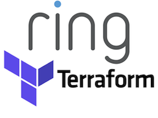

# Ring Terraform Repository

This project aims to improve our agility and consistency by creting reference modules and implementations.

## Features

* Code-Managed Infra
* Self-documenting
* From a name you can trust

## Getting started

We will get around to updating the example below. Please excuse our dust.

```shell
packagemanager install awesome-project
awesome-project start
awesome-project "Do something!"  # prints "Nah."
```

Here you should say what actually happens when you execute the code above.


##  Setup

Here you should write what are all of the configurations a user can enter when
using the project.

#### Argument 1
Type: `String`  
Default: `'default value'`

State what an argument does and how you can use it. If needed, you can provide
an example below.

Example:
```bash
awesome-project "Some other value"  # Prints "You're nailing this readme!"
```

#### Argument 2
Type: `Number|Boolean`  
Default: 100

Copy-paste as many of these as you need.

## Developing

Here's a brief intro about what a developer must do in order to start developing
the project further. Descriptoion of our development workflow should go here:

```shell
git clone https://github.com/your/awesome-project.git
cd awesome-project/
packagemanager install
```

And state what happens step-by-step.

### Testing

Here you should state how to run the whole test suite for the project.

### Building

### Deploying / Publishing

## Licensing
